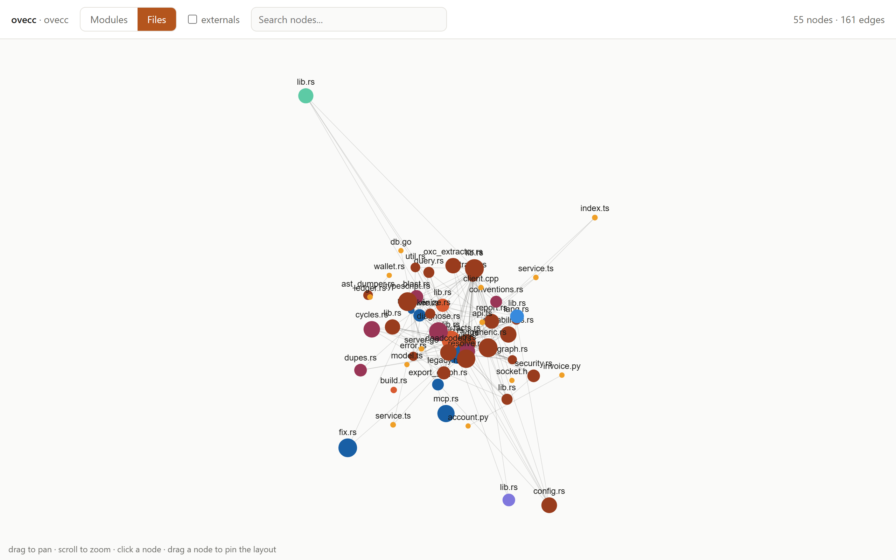

<div align="center">

  

  <p>
    <b>CLI-first architecture intelligence for modern codebases</b>
  </p>

  <p>
    Turn your repository into a deterministic architecture graph.<br/>
    Analyze impact, drift, coupling, and ownership, and enforce the intended
    architecture as code, directly from the CLI.
  </p>

  <!-- Badges -->
  <p>
    <a href="https://github.com/Ovecc-labs/ovecc/actions/workflows/ci.yml"></a>
    <a href="LICENSE"></a>
    <a href="../../releases/latest"></a>
    
  </p>

</div>


---

## What is Ovecc

Ovecc is a CLI-first architecture intelligence engine. It builds a deterministic,
persistent model of a repository and answers architectural questions about
structure, change impact, coupling, drift, ownership, security, and long-term
maintainability.

Ovecc is not a code generator, a chat tool, or a dashboard. It is an
architecture database plus deterministic analysis commands that make
architecture queryable and enforceable. AI-assisted coding raises both code
output and the risk of architectural erosion; Ovecc exists for that problem.
An LLM may consume Ovecc's output, but it is never the source of truth.

```text
Repository -> deterministic analysis -> architecture database -> insights -> optional AI explanation
```

<picture>
  <source media="(prefers-color-scheme: dark)" srcset="docs/img/graph-viewer-dark.png">
  
</picture>
<p align="center"><i>ovecc's own dependency graph, rendered by <code>ovecc export graph --html</code> into one self-contained offline file.</i></p>

The full design is in [ARCHITECTURE.md](ARCHITECTURE.md). Measured performance and
answer accuracy on real repositories are in
[docs/benchmark/BENCHMARKS.md](docs/benchmark/BENCHMARKS.md).

## Install

Grab a prebuilt binary from the
[**latest** release](../../releases/latest) (Linux and Windows x86_64). Drop it
on your `PATH` and run `ovecc index .`; there is nothing else to install
(DuckDB is bundled, no runtime, fully offline). A rolling
[dev build](../../releases/tag/latest) is also published on every push to
`main`.

### Build from source

The workspace builds with stable Rust (on Windows use the `windows-gnu`
toolchain; DuckDB is bundled and compiled from source on the first build; the
step-by-step Windows toolchain setup is in
[docs/dev/SETUP.md](docs/dev/SETUP.md)).

```sh
cargo build --release
cargo test --workspace
```

The binary is `ovecc` (`crates/ovecc-cli`).

## Quick start

```sh
ovecc index .                 # parse, resolve, and persist the model into .ovecc/
ovecc capabilities            # machine-readable contract: commands, metrics, rules, exit codes
ovecc summary                 # coupling, density, cycles, risk score
ovecc violations              # architecture + security findings, with file:line
ovecc diagnose                # named architectural smells, evidence + curated remediation
ovecc security                # secrets, insecure patterns, weak crypto, tainted flows
ovecc audit                   # offline OSV dependency vulnerabilities
ovecc impact Billing          # blast radius of a change
ovecc hotspots                # churn x coupling x ownership debt ranking
ovecc dupes                   # duplicated code (clone families), file:line
ovecc health                  # functions over the complexity thresholds (oxc)
ovecc deadcode                # unused exports + unreachable files (oxc + reachability)
ovecc fix                     # apply the mechanical fixes for those findings (dry-run by default)
ovecc query "cycles"          # actual elementary dependency cycles (A -> B -> A)
ovecc report                  # one-shot architecture report (markdown or json)
ovecc gate                    # CI gate: fail a PR on new cycles / violations
ovecc review                  # the NAMED new defects a change introduced (file:line + cycle witnesses)
ovecc architecture init       # draft .ovecc/architecture.toml from the graph, or from a built-in --template
ovecc architecture check      # gate the code against the contract: divergences, slice/capability/budget verdicts
ovecc architecture suggest    # recognize which built-in architecture the repo already follows
ovecc explain Billing         # offline, deterministic explanation
ovecc export graph --html     # interactive dependency-graph viewer, one self-contained offline file
ovecc mcp                     # MCP server over stdio: expose every command as an agent tool
ovecc index . --exclude "vendored/**"   # built-in excludes (node_modules, .venv, ...) plus your own
```

Every command renders as `text`, `json`, `ndjson`, or `markdown` via `--format`
(plus `sarif` for GitHub code scanning and `codeclimate` for GitLab Code Quality),
and returns stable exit codes for CI. The full per-command reference, with real
output excerpts, is in [docs/COMMANDS.md](docs/COMMANDS.md). For pull requests,
the repo ships a drop-in [GitHub Action](action.yml) that indexes base + head,
comments the `review` findings on the PR, and gates on severity.

## For AI agents

Ovecc is built to be consumed by AI systems first. Start with the contract:

```sh
ovecc capabilities --format json
```

It returns every command, the metrics and rules they emit (each with a
definition), the severity vocabulary, the exit-code contract, and the output
formats: enough to drive an end-to-end audit without reading these docs.

### MCP server

`ovecc mcp` runs a Model Context Protocol server over stdio, exposing the
commands above as tools (`ovecc_summary`, `ovecc_impact`, `ovecc_deadcode`,
`ovecc_query`, `ovecc_capabilities`, …) so a coding agent can ask *"is this
export used?"*, *"what's the blast radius of `BillingService`?"*, or *"give me
the context slice for this PR"* live. Each tool returns the same JSON envelope
and takes an optional `repo` path. Register it with an MCP client, e.g.:

```json
{ "mcpServers": { "ovecc": { "command": "ovecc", "args": ["mcp"] } } }
```

Have the agent call `ovecc_capabilities` first for the full contract, and
`ovecc_index` once before querying a repository.

Every command's JSON is wrapped in a stable, self-describing envelope:

```json
{
  "schema_version": 1,
  "tool": { "name": "ovecc", "version": "0.1.0" },
  "command": "summary",
  "meta": { "metrics": { "...": {} }, "rules": { "...": {} } },
  "data": { "...": {} }
}
```

- `schema_version` is an integer; **additive** changes never bump it, so detect
  new fields by key presence rather than gating on the number.
- `meta` carries metric/rule definitions so values are interpretable without the
  docs site.
- Output is path-normalized (repo-relative, POSIX) and **byte-identical across
  runs** for an unchanged database.
- Exit codes are stable: `0` ok · `1` a `--fail-on` threshold crossed · `2` usage
  · `3` repository/config · `4` index/db · `5` parser · `6` git · `7` internal.

Portions of Ovecc are adapted from [fallow](https://github.com/fallow-rs/fallow)
(MIT); see [THIRD-PARTY-NOTICES.md](THIRD-PARTY-NOTICES.md).

## Governance

### Architecture contracts

`.ovecc/architecture.toml` declares the intended architecture as code: the
components, and the only dependencies each one may have.

```toml
[[component]]
name = "api"
paths = ["src/api/**"]
depends_on = ["core"]

[[component]]
name = "features"
paths = ["src/features/**"]
depends_on = ["core"]
slices = true                       # features must not import each other

[[component]]
name = "core"
paths = ["src/core/**"]
interface = ["src/core/index.ts"]   # the only legal door into core
external_deny = ["pg*"]             # pure logic: no DB client imports
deny_capabilities = ["network", "time", "random"]  # a pure, deterministic core
max_cyclomatic = 15                 # a per-function fitness budget
```

`ovecc architecture init` drafts the contract from the observed graph — every
entry mirrors an import that exists today, so day one has zero violations and
governance is deleting the entries you regret. Or start from the canon:
`init --template <name>` writes a reference architecture as the contract (no
index required) from the built-ins `fsd`, `bulletproof-react`, `nx-workspace`,
or `clean-architecture`, and the diff against it is your migration plan. From
then on every index diffs the code against the contract in reflexion-model
verdicts: an undeclared dependency is a **divergence**, an import that skips a
declared interface is a **bypass**, a declared edge nobody implements is an
**absence**. Interfaces are virtual — enforced on the observed edges, no barrel
files required, so encapsulation costs neither tree-shaking nor an extra
re-export layer.

The contract governs more than the import graph. `slices = true` turns on
slice isolation: sibling slices of a component (each first-level directory)
may not import each other, the rule behind Feature-Sliced Design and
bulletproof-react, with FSD's `@x` public-API exception honored. Two verdicts
read the code itself: `deny_capabilities` forbids a component the ambient
capabilities that break functional purity (network, filesystem, storage, dom,
process, the clock, randomness), so a `Date.now()` in a pure domain is a
verdict with its `file:line`; and `max_cyclomatic` / `max_cognitive` set a
per-function complexity budget, a fitness function that lives in the contract.

`ovecc architecture suggest` closes the loop: point it at an indexed repository
and it recognizes which built-in template the code most resembles, detects the
root (`src/`, or `apps/web/src/` in a monorepo), and scores the fit as
coverage times conformance. A repository that follows a known architecture gets
the matching contract bound to its real paths; one that follows none is told
so. It is recognition against a curated basket, not architecture recovery from
scratch, so it stays deterministic and offline.

`ovecc architecture check` turns the verdicts into a CI gate. Progressive
adoption is built in: `check --freeze` accepts today's violations into a
per-component baseline store (line-per-violation files that merge cleanly),
new violations gate from then on, and a ratchet drops corrected entries so the
debt only shrinks. Agents ask the contract before editing —
`ovecc architecture show <path>`, or the `ovecc_architecture` MCP tool — and
the same verdicts come back through `violations`, `review`, and the PR
comment of the GitHub Action.

### Rules

Declarative, language-neutral policy lives in `.ovecc/config.toml`, is enforced
at index time, and is surfaced by `violations` (and the `gate` CI check):

```toml
# Forbid a module-to-module dependency.
[[rules.boundaries]]
name = "billing must not depend on user"
source = "billing"
target = "user"
allowed = false
severity = "high"

# Ban imports by specifier pattern (exact, prefix*, *suffix, or *infix*).
[[rules.banned_imports]]
name = "no-deprecated-lodash"
pattern = "lodash"
message = "use es-toolkit instead"
severity = "medium"
```

Silence a specific finding inline with `// ovecc-ignore` (or
`// ovecc-ignore-next-line`, and `# ovecc-ignore` in Python) on the offending
line; the finding is dropped at index time.

## Languages

The JavaScript/TypeScript family is parsed with tree-sitter and enriched by the
pure-Rust **oxc** stack behind the parser boundary: real `tsconfig`
paths/`exports` module resolution (`oxc_resolver`), plus per-function complexity
and exports (`oxc_parser`/`oxc_semantic`). A single specification-driven
tree-sitter adapter covers Python, Go, Rust, and C++. All feed the same
language-agnostic model, so resolution, the call graph, taint, and the rules work
across every supported language; adding a language is a new extractor behind the
boundary, not a core change.

## Workspace layout

Ten library crates and one binary, each documented in its own `README.md`
(plus `xtask`, the std-only development task runner behind `cargo xtask`):

| Crate | Responsibility |
| --- | --- |
| [`ovecc-core`](crates/ovecc-core) | Data model, typed ids, config, error type, trait contracts |
| [`ovecc-parser`](crates/ovecc-parser) | Tree-sitter adapters and security pattern detection |
| [`ovecc-indexer`](crates/ovecc-indexer) | Indexing pipeline: discover, parse, resolve, analyze, persist |
| [`ovecc-db`](crates/ovecc-db) | DuckDB persistence, migrations, differential sync |
| [`ovecc-git`](crates/ovecc-git) | Native Git history, churn, ownership (via gix) |
| [`ovecc-graph`](crates/ovecc-graph) | Blast radius, hotspots, cycles, conventions |
| [`ovecc-rules`](crates/ovecc-rules) | Rule evaluation and security classification |
| [`ovecc-dataflow`](crates/ovecc-dataflow) | Source-to-sink taint reachability |
| [`ovecc-audit`](crates/ovecc-audit) | Offline OSV dependency audit |
| [`ovecc-ai`](crates/ovecc-ai) | Optional deterministic, offline explanation |
| [`ovecc-cli`](crates/ovecc-cli) | Command-line interface |

## Design guarantees

- **Deterministic before generative.** Every finding is traceable to explicit
  facts; the same input produces the same output.
- **Local and private.** Indexing, analysis, and explanation run on the machine;
  nothing is sent anywhere.
- **Incremental.** A re-index of an unchanged repository re-parses nothing and
  writes only a new snapshot.

## License

Apache-2.0; see [LICENSE](LICENSE). Third-party attributions are in
[THIRD-PARTY-NOTICES.md](THIRD-PARTY-NOTICES.md).
